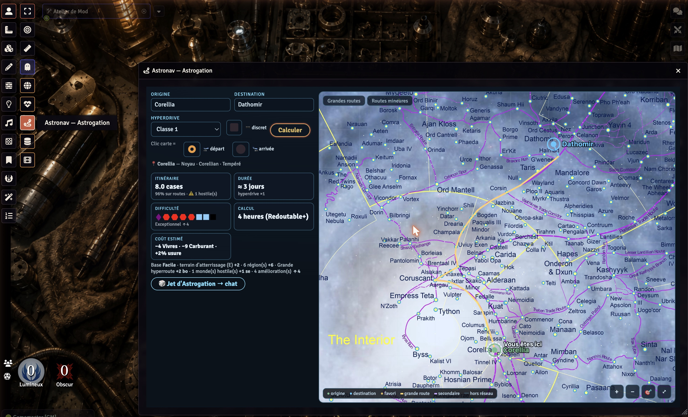

# SWFFG Astronavigation — Astrogation & Atlas galactique

Module [Foundry VTT](https://foundryvtt.com/) pour le système **Star Wars FFG** (`starwarsffg`) :
une **carte galactique interactive**, un **calculateur d'astrogation** aux règles FFG, et un
**atlas de 6 849 mondes** — le tout intégré à Foundry.



## ✨ Fonctionnalités

- 🗺️ **Carte galactique** — fond GFFA, zoom/déplacement, hyperroutes canon (grandes & mineures),
  tracé de l'itinéraire calculé (A\*) coloré par type de route.
- 🧭 **Calculateur d'astrogation** — origine → destination parmi ~6 800 mondes ; **difficulté**
  du test (vrais glyphes de dés FFG), **durée**, **coût** (vivres / carburant / usure), mode
  **discret** (évite les factions hostiles), jet posté dans le chat.
- 📍 **« Vous êtes ici »** — la position du vaisseau sur la carte ; un **jet d'astrogation réussi
  déplace le groupe** vers la destination.
- 🪐 **Atlas de 6 849 planètes** — compendium en fiches **Monk's Enhanced Journal « Place »**
  (image, secteur, coordonnées, terrain, climat, population, affiliations, description).
- ⭐ **Favoris** — épingle tes mondes (marque-pages MEJ), ils apparaissent sur la carte.
- 🎚️ **Réglable par le MJ** — difficulté des voyages (Très facile ↔ Très difficile, milieu = FFG),
  factions hostiles (cases à cocher), étiquettes de ressources.

## 📦 Installation

Dans Foundry : **Modules → Installer un module**, puis colle l'URL du manifeste :

```
https://github.com/wanoo/swffg-astronavigation/releases/latest/download/module.json
```

**Dépendance requise** : [Monk's Enhanced Journal](https://foundryvtt.com/packages/monks-enhanced-journal)
(les fiches planètes sont des sheets « Place »). Foundry propose de l'installer automatiquement.

Au **1er lancement (MJ)**, le module propose d'**importer l'atlas dans les journaux** (requis pour
l'affichage MEJ et les favoris ; les fiches sont visibles par les joueurs).

## 🚀 Utilisation

- Le bouton **route** (barre d'outils de scène, groupe *Jetons*) ouvre l'Astronav.
- Choisis deux mondes (saisie, **clic sur un marqueur**, favori, ou bouton d'une fiche planète),
  puis **Calculer** → itinéraire tracé + difficulté + coût. **Jet → chat** pour lancer.
- API (autres modules) : `game.modules.get("swffg-astronavigation").api` — `open()`, `setLeg()`,
  `setCurrentWorld()`, `favorites()`, `importToWorld()`, `lastCost` + hook `swffgAstronav.cost`.

## 🐞 Un bug ? Une idée ?

**Ouvre une issue** : <https://github.com/wanoo/swffg-astronavigation/issues/new/choose>
Merci d'indiquer : version de Foundry, version du module, ce que tu faisais, le message d'erreur
(console **F12**), et une capture si possible.

## 🙏 Données & crédits

Systèmes et hyperroutes agrégés depuis Wookieepedia (fr/en) et SWAPI, retravaillés pour l'astrogation
FFG. Fond de carte : *swgalaxymap*. Star Wars et le système FFG appartiennent à leurs ayants droit ;
module de jeu non officiel, gratuit. Auteur : **wanoo**.
